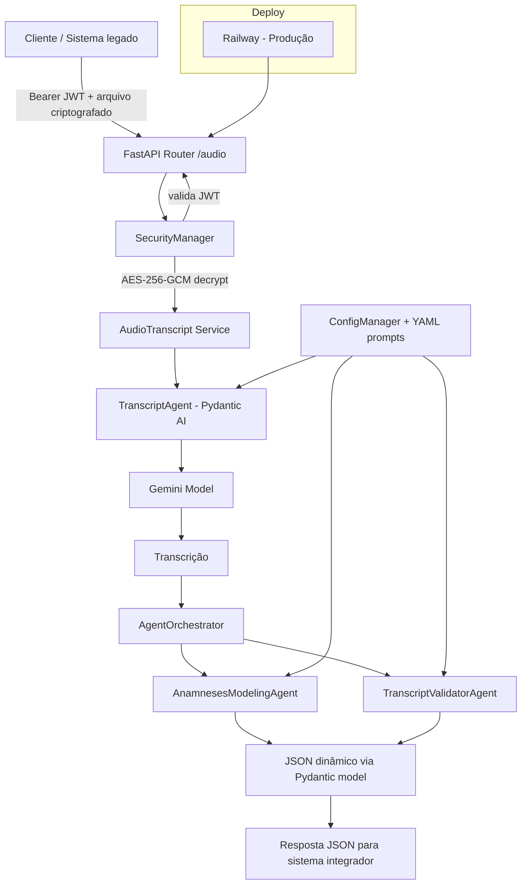

# API de Transcrição e Estruturação de Anamnese com IA

API em `FastAPI` para receber áudio criptografado de consultas, transcrever com LLM e estruturar dados de anamnese em JSON dinâmico para integração com sistemas clínicos existentes.

O projeto foi desenhado com foco em acoplar capacidades de IA a uma arquitetura de serviço já existente, com camadas claras de segurança, orquestração, prompts configuráveis e deploy em produção.

## Objetivo do projeto

- Integrar IA de forma pragmática em um backend de API.
- Transformar áudio médico em dado estruturado consumível por sistemas prévios (EHR, prontuário eletrônico, CRM clínico, automações).
- Garantir segurança no transporte/processamento de áudio (JWT + AES-GCM).
- Permitir evolução rápida do comportamento dos agentes via configurações YAML, sem alterar código de domínio.

## Stack tecnológica

- `Python 3.11`
- `FastAPI` + `Uvicorn`
- `Pydantic` / `Pydantic AI`
- `Gemini (Google GLA Provider)` como modelo de linguagem atual
- `PyJWT` para autenticação
- `cryptography` (AES-256-GCM) para decriptação/criptografia de payloads
- `Docker` + `docker-compose` para ambiente local
- `Railway` para deploy em produção

## Arquitetura

### Visão de alto nível



### Componentes principais

- `app/main.py`
  - Sobe a aplicação FastAPI.
  - Carrega dependências globais via `AppConfigs.load_dependencies()`.
  - Configura `CORS` e `TrustedHostMiddleware`.
- `app/routers/audio.py`
  - `POST /audio/upload`: autentica request, decripta arquivo e dispara transcrição.
  - `POST /audio/prontuario`: recebe transcrição + template e gera estrutura de anamnese.
- `app/security/security.py`
  - Validação JWT (`Authorization: Bearer <token>`).
  - Criptografia/decriptação AES-256-GCM para payloads de áudio.
- `app/services/AudioTranscript.py`
  - Encapsula pipeline de transcrição (router -> agente transcritor).
- `app/services/AgentOrchestrator.py`
  - Orquestra extração estruturada e validação do resultado.
- `app/agents/*`
  - `TranscriptAgent`, `AnamnesesModelingAgent`, `TranscriptValidatorAgent` com base comum em `BaseAgent`.
  - Criação de agentes centralizada em `AgentFactory`, com retry exponencial para falhas transitórias de provider.
- `app/services/ConfigManager.py` + `app/config/configuracao/*.yaml`
  - Prompt engineering externalizado por YAML (agentes e configurações).
  - Suporte a reload de configuração.
- `app/models/models.py`
  - Modelos de API e geração dinâmica de `Pydantic model` a partir do `anamnesis_template`.

## Fluxo funcional (end-to-end)

1. Cliente envia arquivo de áudio criptografado para `POST /audio/upload`.
2. API valida token JWT.
3. API decripta o payload com AES-GCM.
4. `TranscriptAgent` converte áudio em texto.
5. Cliente envia `transcription` + `anamnesis_template` para `POST /audio/prontuario`.
6. API gera modelo Pydantic dinâmico pelo template.
7. `AnamnesesModelingAgent` extrai os campos.
8. O resultado é validado e retornado como JSON estruturado.

## Estrutura de pastas

```text
app/
  main.py
  routers/
    audio.py
  services/
    AudioTranscript.py
    AgentOrchestrator.py
    ChatInterface.py
    ConfigManager.py
  agents/
    AgentBase.py
    transcritor.py
    anamnese.py
    validator.py
  config/
    ConfigDependencies.py
    configuracao/
      transcritor.yaml
      anamnese.yaml
      validador.yaml
  models/
    models.py
  security/
    security.py
  tests/
    test_security.py
```

## Como executar

### 1) Variáveis de ambiente

Crie um arquivo `.env` na raiz:

```env
GOOGLE_API_KEY=...
API_KEY=...          # chave base64-url de 32 bytes para AES-256-GCM
SECRET_KEY=...       # chave JWT
```

### 2) Ambiente local com Docker Compose (recomendado)

```bash
docker compose up --build
```

API local em: `http://localhost:8023`

### 3) Ambiente local sem Docker

```bash
pip install -r requirements.txt
uvicorn app.main:app --host 0.0.0.0 --port 8005 --reload
```

## Endpoints principais

- `GET /` - health check simples
- `GET /audio/` - endpoint informativo
- `POST /audio/upload` - recebe arquivo de áudio criptografado e retorna transcrição
- `POST /audio/prontuario` - recebe transcrição + template e retorna JSON de anamnese

## Exemplo de payload para estruturação (`/audio/prontuario`)

```json
{
  "transcription": "Paciente relata dor torácica há 3 dias...",
  "anamnesis_template": {
    "template_name": "AnamneseCardio",
    "fields": [
      {
        "title": "queixa_principal",
        "type": "text",
        "required": true,
        "llm_instruction": "Descreva a queixa principal com linguagem clínica objetiva."
      },
      {
        "title": "duracao_sintomas",
        "type": "string",
        "required": false,
        "llm_instruction": "Informar duração em termos reportados pelo paciente."
      }
    ]
  }
}
```

## Foco para integração de IA em sistemas previos

- `Arquitetura de integração`: IA encapsulada em serviço HTTP para plugar em sistemas existentes sem reescrever o core do produto.
- `Orquestração de agentes`: separação entre transcrição, extração e validação.
- `Schema-first output`: saída orientada a contrato (modelo Pydantic dinâmico) para reduzir fricção com consumidores.
- `PromptOps`: prompts versionados em YAML, desacoplados do código.
- `Resiliência`: retries com backoff para falhas transitórias de LLM provider.
- `Segurança aplicada`: JWT + criptografia de arquivo em trânsito/aplicação.
- `Deploy real`: execução em produção via Railway.

## Deploy em produção (Railway)

A aplicação está sendo deployada em produção no `Railway`.

Pontos importantes:

- Definir variáveis de ambiente no projeto Railway (`GOOGLE_API_KEY`, `API_KEY`, `SECRET_KEY`).
- Garantir porta esperada pela plataforma (`PORT`) e health check em `/`.
- Revisar CORS/hosts permitidos conforme domínio público.
- Monitorar logs e latência de chamadas LLM.

## Melhorias futuras

### Adição de Whisper local para transcrição

Incorporar um motor de transcrição `Whisper` local na API para aumentar robustez, controle e possível redução de custo por chamada externa.

### Adaptação do ConfigManager para leitura de serviço externo

Modificar o `ConfigManager` para leitura dos arquivos YAML em um serviço externo, como S3, e adicionar um endpoint de hot-reload dos prompts, permitindo versionamento e iterações rápidas com agentes, sem necessidade de novo deploy da aplicação.

- Adicionar visibilidade via OpenTelemetry.
- Adicionar persistência de estado utilizando LangGraph e Redis 
- Transformar em serviço assíncrono


